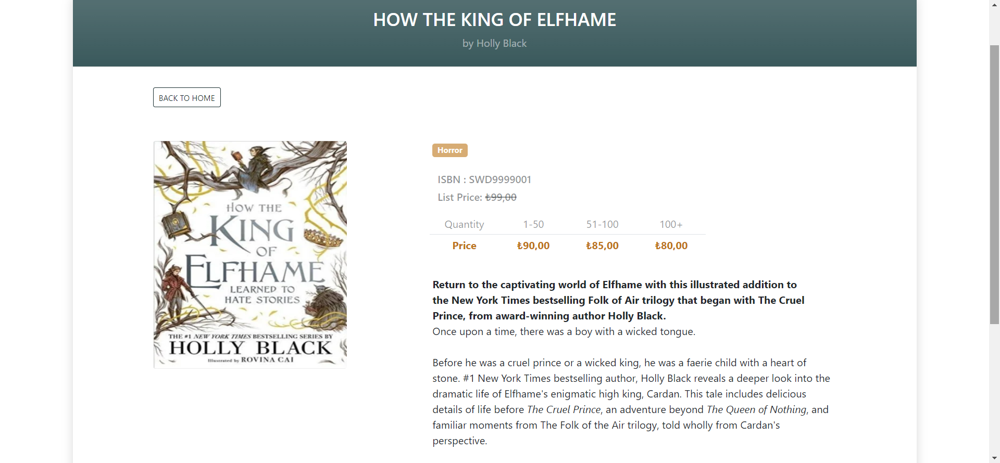
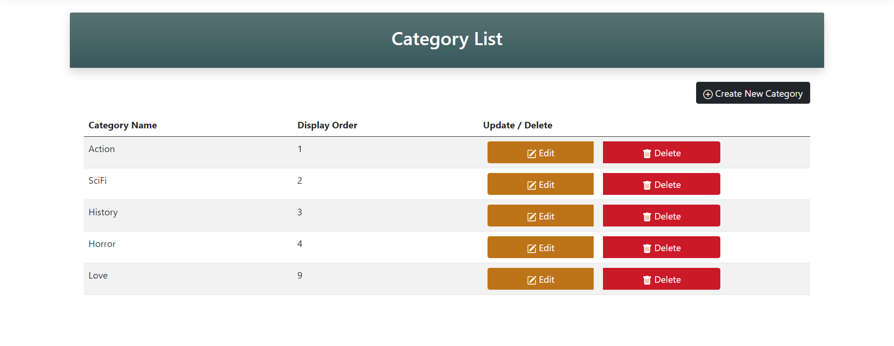
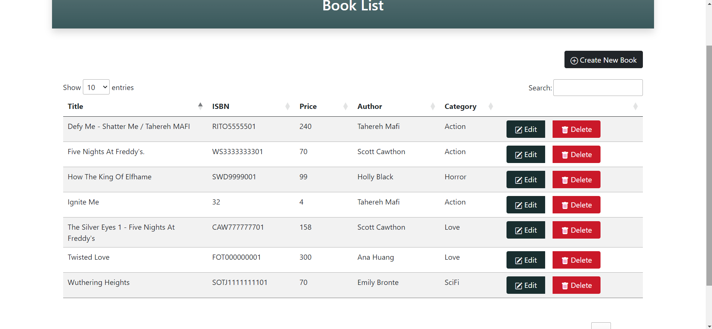
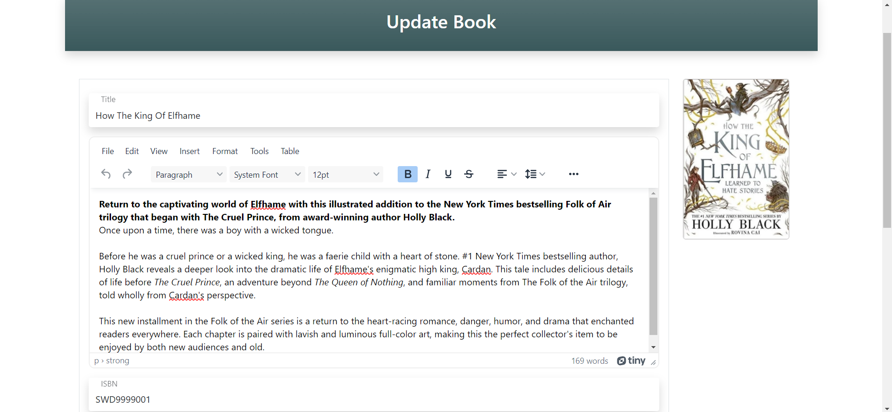
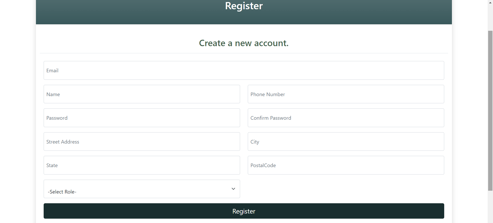
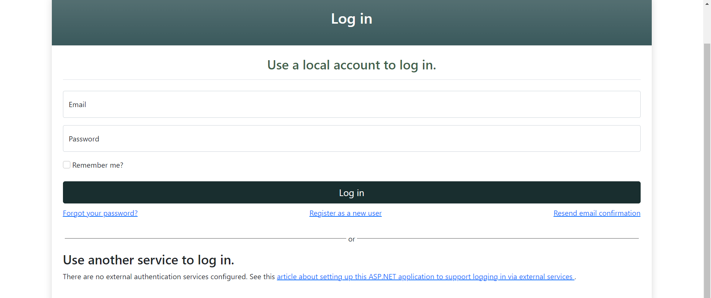
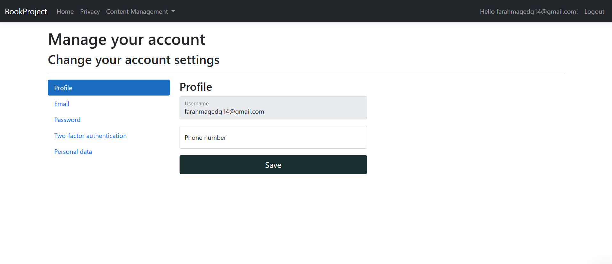

# Bookify – Book Discovery and Management Platform

A full-stack **ASP.NET Core 8 MVC** web application that allows users to explore, organize, and manage books — inspired by platforms like Goodreads. Users can browse books, view details, register and log in, and manage book and category data through a clean, role-based interface.

---

## Features

- **User Accounts** – Secure registration and login using **ASP.NET Identity**
- **Book Catalog** – View all books with search and category filtering
- **Category Management** – Organize books by genres or themes
- **Book Details Page** – Displays detailed book information
- **Admin Capabilities** – Add, update, or delete books and categories
- **Repository & Unit of Work Patterns** – Maintainable, scalable architecture
- **Razor Views + Bootstrap** – Responsive and simple user interface
- **SQL Server Integration** – Entity Framework Core with code-first migrations

---

## Tech Stack

| Layer | Technologies |
|-------|---------------|
| **Frontend** | ASP.NET Core MVC, Razor Pages, Bootstrap |
| **Backend** | ASP.NET Core 8, C# |
| **Database** | SQL Server, Entity Framework Core |
| **Architecture** | Repository Pattern, Unit of Work |
| **Authentication** | ASP.NET Identity (User Login, Registration) |

## Project Screenshots

### Home

### Book Details

### Category List

### Book List

### Book Update

### Register

### Login

### Profile Settings

